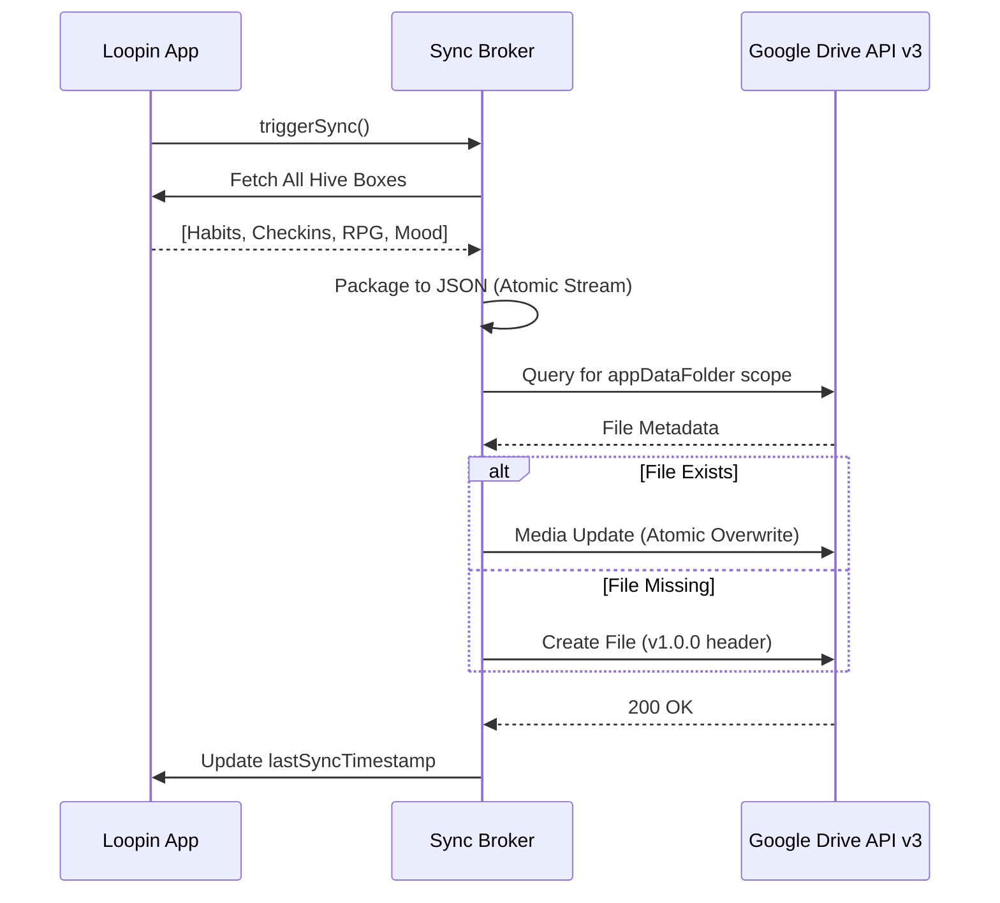

# Deep-Dive: Loopin System Architecture

This specialized document explores the low-level engineering design of the Loopin ecosystem, intended for **Technical Architects** and **Senior Engineering Leads**.

---

## 1. Interaction Design: The Event-Driven RPG Engine

Instead of direct state mutation, the RPG engine uses an **Event-Queue Pattern**. This ensures that rewards (XP, Coins, Achievements) are processed in a cinematic sequence and never overlap, preventing a "notification storm."

### Event Lifecycle
1. **Trigger:** `HabitProvider` detects a completion.
2. **Push:** Sends a `LootResult` to the `RpgProvider` event queue.
3. **Queue Logic:**
    - Checks for **Achievements** (e.g., First habit, 7-day streak).
    - Checks for **Rank Up** (If new XP > Level Threshold).
    - Checks for **Inventory Drops**.
4. **Dispatch:** The `MainNavigationScreen` listens to the queue and pops overlays one by one using a `ValueKey` based `AnimatedSwitcher`.

---

## 2. Data Persistence Layer (Local-First)

Loopin uses **Hive**, a high-performance Key-Value NoSQL database written in pure Dart. This was chosen over SQLite to eliminate the overhead of SQL-to-Object mapping and to provide synchronous reads for UI performance.

### Schema Definitions (TypeAdapters)

| Box Name | Data Type | Key Pattern | Purpose |
| :--- | :--- | :--- | :--- |
| `habit_box` | `HabitModel` | UUID | Core habit settings and metadata. |
| `checkin_box` | `CheckInEntry` | `${habitId}_${date}` | High-density completion tracking. |
| `rpg_profile` | `RpgProfile` | `main_profile` | Player level, XP, inventory, coins. |
| `wellbeing` | `WellBeingEntry` | `${date}` | Mood scoring and daily labels. |

---

## 3. Synchronization & Cloud Brokerage

The sync logic is decoupled into a **GoogleDriveSyncService** to handle OAuth and API orchestration.

### The Atomic Sync Sequence

---

## 4. UI Rendering: Computational Visuals

### Custom Canvas Mood Engine
The mood faces are not SVGs or PNGs; they are **programmatically drawn** using the `CustomPainter` API.
- **Why?** Programmatic drawing allows for seamless interpolation between mood states (e.g., Bored to Happy) and dynamic coloring (e.g., Black-on-Green vs White-on-Dark logic).
- **Efficiency:** Drastically reduces app bundle size and GPU memory usage compared to raster assets.

### Center-Point Navigation Math
The calendar navigation relies on `_todayScrollOffset` logic to maintain user focus:
- `logical_slot = (card_width + gap) * screen_util_ratio`
- `today_position = (past_days_count * logical_slot) + left_padding`
- `centralized_offset = today_position - (screen_width / 2) + (logical_slot / 2)`

This ensures the user's focus is always on the immediate present ("Today"), improving completion conversion rates.

---

## 5. Security Architecture

- **OAuth 2.0 Scopes:** Limited strictly to `drive.appdata` (access to app-specific hidden folder) and `userinfo.email`. 
- **Encryption:** (Roadmap) TEE-based (Trusted Execution Environment) encryption for the backup file before cloud upload.
