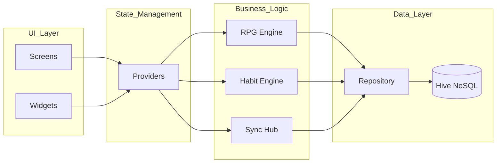
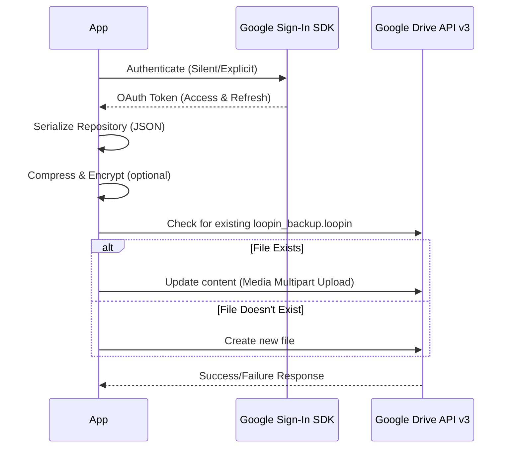

# Internal Architecture & System Design

This document provides a deep dive into the engineering principles and technical decisions behind **Loopin**.

---

## 1. High-Level System Architecture

Loopin follows a clean separation of concerns using a **Service-Provider-Repository** pattern.



---

## 2. Data Schema & Persistence

### Local Data (Hive)
Hive is used over SQLite for its superior speed in Flutter. All data is categorized into **TypeAdapters**.

#### Habit Model
```json
{
  "id": "uuid",
  "title": "String",
  "targetCount": "int",
  "streak": "int",
  "difficulty": "enum[easy, medium, hard]",
  "createdAt": "DateTime"
}
```

#### RPG Profile
```json
{
  "displayName": "String",
  "xp": "int",
  "level": "int",
  "coins": "int",
  "inventory": "List<Item>",
  "unlockedBadges": "List<String>"
}
```

---

## 3. Synchronization Flow (Cloud Sync)

Syncing handles the transfer of local state to the user's private Google Drive storage.



---

## 4. UI/UX Principles: The Centered Timeline

The habit strip is a proprietary UI component. To ensure "Today" is always the hero, the following viewport logic is applied:

1. **Window of Focus:** 30 days of history + 2 days of future intention are calculated.
2. **Dynamic Offset:** The `ScrollController` calculates the exact pixel offset required to center the "Today" card within the current device width.
3. **Responsive Scaling:** Using `flutter_screenutil`, the cards scale proportionally across tablet and mobile layouts without losing the "Focal Point" center.

---

## 5. Security & Privacy

- **Zero PII Storage:** No Personally Identifiable Information (PII) is ever sent to an external server.
- **Local-Only:** The app functions 100% offline.
- **User-Owned Cloud:** Data backup uses the user's personal drive scope (`drive.appdata`), ensuring Loopin cannot access the user's personal files outside the app's own folder.
