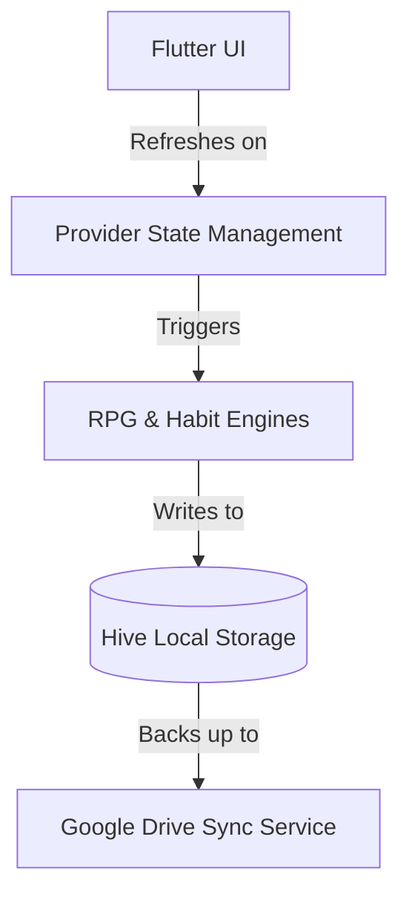

# Loopin: A Gamified Personal Productivity App

Loopin is a habit tracker built with Flutter that focuses on privacy and user engagement. It uses a local-first architecture to ensure data ownership and integrates RPG (Role-Playing Game) elements to make habit consistency more engaging.

---

## 📌 Project Overview

The primary goal of Loopin is to provide a tool for habit tracking where users don't have to worry about their data being stored on third-party servers. All data is persisted locally and synced directly to the user's Google Drive. To increase retention, it uses an XP and Level system similar to an RPG.

[**Download Release APK**](https://github.com/maisachinsharmahu/Loopin-Showcase/releases/tag/v1.0.0)

---

## 🛠 Features and Design

### 1. Centralized Habit Timeline
The app uses a custom horizontal calendar strip where "Today" remains centered. This focal point approach makes it easy to track current tasks while maintaining a scrollable history.

<p align="center">
  
  
</p>

### 2. RPG Reward Engine
Instead of just checkmarks, completions trigger XP gain, level progression, and loot drops. I implemented an event-driven queue to handle these rewards sequentially so they don't overlap in the UI.

<p align="center">
  
  
  
</p>

### 3. Data Insights and Analytics
I used Hive for the database because it's fast enough to handle real-time stats calculations. The app provides visual feedback on streaks, completion percentages, and productivity trends.

<p align="center">
  
  
  
</p>

### 4. Achievements and Social
Users can unlock badges based on milestones. There is also a "Rivals" section where users can challenge themselves against others while maintaining encrypted data privacy.

---

## 🏗 Technical Implementation

### System Architecture
The app follows a **Reactive MVVM** pattern. I chose **Provider** for state management to keep the business logic (RPG calculations and sync) separate from the UI widgets.



### Data Synergy and Persistence
I used **Hive (NoSQL)** for all persistence. It works by storing data in binary "boxes" which is much faster than traditional SQL on mobile devices.
- `habit_box`: Stores habit configurations.
- `checkin_box`: Stores daily logs using a `${habitId}_${date}` key format.
- `rpg_profile_box`: Stores XP, Coins, and Inventory.

---

## 🔬 Engineering Case Studies

### 1. Atomic Sync Implementation
Syncing data with Google Drive was a challenge because network drops can cause partial data loss. I implemented an **Atomic Sync** logic:
- The app serializes all Hive data into a single JSON stream.
- It performs a multipart upload to a hidden `appDataFolder` in the user's Drive.
- The local state only updates 'lastSync' once the Drive API confirms a 200 OK status.

### 2. Centered Timeline Logic
To keep "Today" centered across different screen sizes, I had to calculate the scroll offset manually in the `initState`:
```dart
offset = (pastDays * cardWidth) + padding - (screenWidth / 2) + (cardWidth / 2)
```
This ensures the focal point is consistent regardless of the device's resolution or DPI.

### 3. iOS File Support
iOS doesn't recognize custom file extensions like `.loopin` by default. I had to register a custom **UTI (Uniform Type Identifier)** in the `Info.plist`. This allows the iOS Files app to recognize the backup file and let users select it for manual restores.

---

## 📈 Future Enhancements
- On-device AI to analyze habit-mood correlations.
- End-to-End Encrypted (E2EE) P2P challenges with friends.
- Multi-cloud support for users who don't use Google Drive.

---
*Note: This repository is a technical showcase for my portfolio. The source code is proprietary and not available here.*
