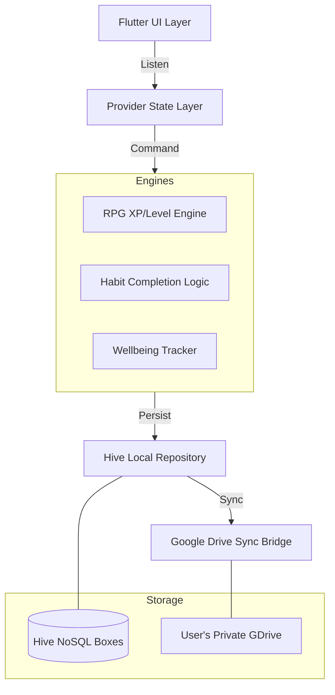

# 🌀 Loopin: Gamified Privacy-First Productivity

> **Level up your habits. Own your data. Conquer your day.**

Loopin is a premium, offline-first habit tracker that merges **Character RPG mechanics** with a **Zero-Knowledge privacy architecture**. Built with Flutter, it challenges the status quo of productivity apps by ensuring that your personal growth data remains entirely yours, synced only via your private cloud.

---

## 💎 The Vision

Most habit trackers are either too boring (spreadsheet-like) or too invasive (server-side data storage). **Loopin** solves this by:
1. **Gamification:** Turning every discipline into XP and Loot Drops.
2. **True Privacy:** Utilizing a "Zero-Server" architecture.
3. **Frictionless UI:** A custom scrollable timeline that keeps "Today" as your focal point.

---

## 🏗 System Architecture & Design

Loopin is built with a decoupled, event-driven architecture designed for high performance and reliability.

### 1. High-Level Architecture
The app follows a **Reactive MVVM (Model-View-ViewModel)** pattern using `Provider` for state management. This ensures that the UI layers are strictly decoupled from the internal RPG engine and sync logic.

### 2. Multi-Store Data Strategy
Instead of a single heavy database, data is stored across five specialized **Hive Boxes** to minimize memory footprint and enable sub-millisecond lookups during scrolling.

- `habit_box`: Core habit definitions and configurations.
- `checkin_box`: Historical completion data indexed by `${habitId}_${dateKey}`.
- `rpg_profile_box`: Character stats, XP, inventory, and unlock history.
- `wellbeing_box`: Daily mood scores and labels.
- `inbox_box`: Event logs and system notifications.

---

## ⚡ Technical Highlights

### 🔁 Atomic Sync & Data Integrity
Loopin implements a custom synchronization engine that prioritizes data integrity over simple snapshots.
- **Serialization:** All Hive boxes are serialized into a single, structured JSON stream.
- **Atomicity:** The sync process uses a "Write-Ahead" style approach where a temporary `.loopin.tmp` file is verified before replacing the main backup file on Google Drive, preventing corruption during network failures.
- **OAuth 2.0 Flow:** Secure sign-in without storing any user credentials on Loopin servers (because there are no Loopin servers).

### 🎮 RPG Event Queue
To prevent UI jank during reward bursts (e.g., completing a habit that triggers both XP, a Loot Drop, and an Achievement), Loopin uses a **Centralized Event Queue**.
- Events are pushed into a `LootResult` queue.
- The UI pops and displays them sequentially via a dedicated `LootDropOverlay`.
- This ensures a cinematic "reward chain" experience without overlapping popups.

### 📅 Responsive Calendar Math
The horizontal habit strip is a high-performance `ListView` with a custom `ScrollController`. 
- **Center-Calculation:** `_todayScrollOffset = (pastDays * cardSlot) + padding - screenW/2 + cardW/2`.
- This ensures that "Today" is always globally centered across different device widths and DPI settings, maintaining a consistent focus point for the user.

---

## 🛠 Tech Stack

- **Framework:** Flutter (Dart)
- **State Management:** Provider
- **Local Database:** Hive NoSQL
- **Storage/Sync:** Google Drive API v3
- **Networking:** Google Sign-In SDK
- **Design:** Custom Canvas & Flutter Canvas (for Mood graphics)

---

## 📸 Visual Showcase

| Home Strip | Character Profile | Stats View |
| :---: | :---: | :---: |
|  |  |  |

---

## 🚀 Installation & Roadmap

Loopin is currently in private beta. You can download the latest production-ready APK from the **Releases** section.

**Upcoming Milestones:**
- [ ] AI-Driven Habit Recommendations.
- [ ] Collaborative "Boss Raids" with Rivals.
- [ ] Multi-Cloud Support (Dropbox/OneDrive).

---
*Note: This repository is a technical showcase and documentation hub. The source code is proprietary and not included here.*
