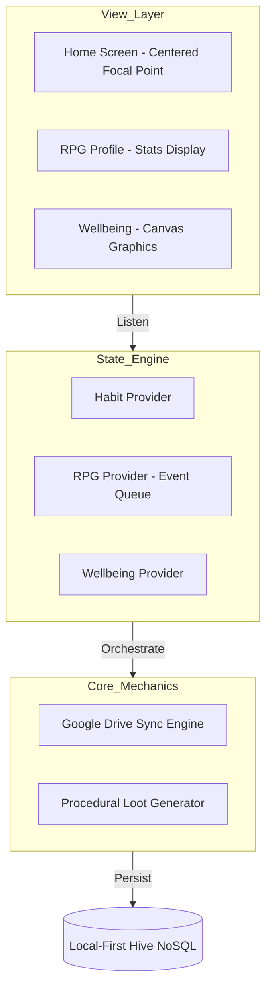

# 🌀 Loopin: The Privacy-Centric Productivity Ecosystem

**Loopin** is an engineering-first productivity application that merges **Behavioral Psychology (RPG Mechanics)** with a **High-Performance Local-First Architecture**. It is designed for high-agency individuals who demand absolute data ownership without sacrificing the dopamine-driven engagement of modern gamified apps.

---

## 📈 The Investor Case: Scaling Privacy

In an era of increasing data regulation and user privacy awareness, Loopin is built on a **Zero-Server Business Model**:
- **Zero Infrastructure Overhead:** No centralized databases or backend servers. Operations scale horizontally at zero cost per user.
- **Data Sovereignty:** Users own their data on their private Google Drive. This eliminates liabilities related to data breaches (GDPR/CCPA compliant by design).
- **Engagement Loop:** Integrated RPG Engine maintains high retention rates through a 24-hour "Consistency Challenge" loop.

[**Download Production APK**](https://github.com/maisachinsharmahu/Loopin-Showcase/releases/tag/v1.0.0) | [**Technical Deep Dive**](ARCHITECTURE.md)

---

## 🏗 Engineering Architecture

Loopin is architected using **Reactive MVVM (Model-View-ViewModel)** principles, ensuring a strict separation between UI presentation and complex behavioral logic.

### High-Level Design Pattern

---

## 🔬 Engineering Case Studies (Technical "Wins")

### 1. The Centered Timeline Focal Point
**Problem:** Traditional scrollable lists lose the "Current Day" context when the user navigates past dates, leading to cognitive friction.
**Solution:** A custom `ScrollController` with a dynamic viewport calculation.
- **The Math:** `Offset = (TargetIndex * CardWidth) + Padding - (ScreenWidth / 2) + (CardWidth / 2)`
- Real-time DPI-aware scaling ensures "Today" is always the hero across any device factor.

### 2. Atomic Cloud Synchronization
**Problem:** Network failures during large data syncs can corrupt the state, leading to "Partial Restore" bugs.
**Solution:** An atomic **Write-Ahead Sync Strategy**.
- Data is serialized into a proprietary binary-streamed JSON format.
- Syncing triggers an atomic overwrite on a hidden `appDataFolder` scope in Google Drive.
- Verification happens pre-restore to ensure total data integrity before local ingestion.

### 3. iOS Custom Document Type Handling
**Problem:** iOS restricts file selection for unknown extensions, making `.loopin` backup files "invisible" to users.
**Solution:** Explicit UTI (Uniform Type Identifier) registration.
- Implemented `UTExportedTypeDeclarations` and `CFBundleDocumentTypes` in `Info.plist`.
- This ensures the iOS Files app recognizes `.loopin` files as professional editor documents, enabling seamless cross-platform backup sharing.

---

## 🛠 Technical Specification

- **Framework:** Flutter 3.x (Dart)
- **Local Database:** [Hive](https://pub.dev/packages/hive) — NoSQL for sub-millisecond local-first lookups.
- **State Management:** [Provider](https://pub.dev/packages/provider) — Simplified dependency injection and reactive state.
- **Sync Protocol:** OAuth 2.0 + Google Drive API v3.
- **Graphics:** Custom Flutter `Canvas` for the dynamic Mood Facial Engine.

---

## 📸 Experience Gallery

| 📅 The Centered Strip | 🛡 Character Growth | 📊 Performance Stats |
| :---: | :---: | :---: |
|  |  |  |

---

## 🛤 Professional Roadmap

### Phase 1: Foundation (Current)
- [x] Local-first Hive architecture.
- [x] Initial RPG XP/Level Logic.
- [x] Google Drive Sync Bridge (Android/iOS).

### Phase 2: Social & Scaling (Q3 2026)
- [ ] **Rivals Peer-to-Peer:** Real-time habit tracking with encrypted P2P data exchange.
- [ ] **AI-Coaching:** On-device habit difficulty adjustment based on mood-habit correlation data.

--- 
*Note: This repository is a technical portfolio showcasing architectural decisions and engineering outcomes. The source code is proprietary.*
