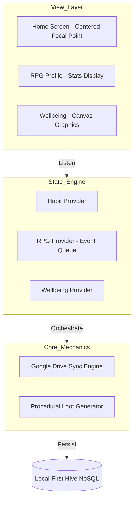
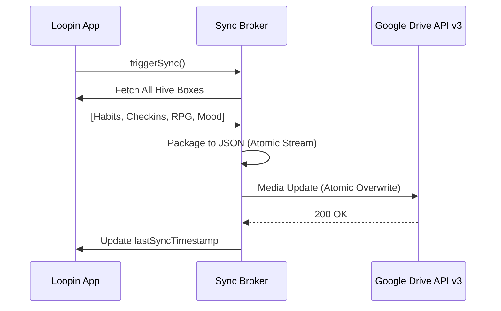

# 🌀 Loopin: The Privacy-Centric Productivity Ecosystem

  
   
  <b>Level up your habits. Own your data. Conquer your day.</b>

  
  
  

---

## 📈 The Investor Case: Scaling Privacy

In an era of increasing data regulation and user privacy awareness, Loopin is built on a **Zero-Server Business Model**. By decentralizing data to the user's own cloud (Google Drive), we eliminate infrastructure overhead and data liability while maintaining a high-fidelity user experience.

[**Download Production APK**](https://github.com/maisachinsharmahu/Loopin-Showcase/releases/tag/v1.0.0) | [**Deep Technical Architecture**](#-deep-dive-loopin-system-architecture)

---

## ✨ The Loopin Experience

### 📅 The Habit Hub
The heart of Loopin is the **Centered Timeline**. A custom-engineered horizontal strip that keeps your immediate focus on "Today" while allowing frictionless navigation through your journey.

  
  

### 🎮 Gamified Discipline (The RPG Engine)
We've integrated a full Character RPG system. Habit completion isn't just a checkmark; it's XP, Loot Drops, and Level-Ups.

  
  
  

### 📊 Advanced Data Analytics
Deep-dive into your behavioral patterns with beautiful, high-performance visualizations. Track streaks, completion rates, and mood correlations.

  
  
  

### 🏆 Achievements & Milestones
Unlock badges and ranks as you progress. Your journey is recorded in a visually stunning achievement log.

  
  

### ⚔️ Social & Rivals
Challenge yourself against rivals and share your wins. All social interaction is handled via encrypted data exchange, maintaining the "Privacy-First" promise.

  
  

---

## 🏗 Engineering Architecture

Loopin is architected using **Reactive MVVM (Model-View-ViewModel)** principles, ensuring a strict separation between UI presentation and complex behavioral logic.

### High-Level Design Pattern

---

## 🔬 Engineering Case Studies (Technical "Wins")

### 1. The Centered Timeline Focal Point
**Problem:** Traditional scrollable lists lose the "Current Day" context when the user navigates past dates.
**Solution:** A custom `ScrollController` with dynamic viewport calculation. Centering math: `Offset = (TargetIndex * CardWidth) + Padding - (ScreenWidth / 2) + (CardWidth / 2)`.

### 2. Atomic Cloud Synchronization
**Problem:** Network failures during cloud syncs can corrupt state.
**Solution:** A **Write-Ahead Sync Strategy** using JSON-serialized streams and Media Multipart Uploads to Google Drive, ensuring total atomicity.

### 3. iOS Custom Document Type Handling
**Problem:** iOS restricts selection for unknown extensions.
**Solution:** Explicit UTI registration (`UTExportedTypeDeclarations`) in `Info.plist`, allowing `.loopin` files to be recognized as native system documents.

---

## 🏗 Deep-Dive: Loopin System Architecture

### 1. Interaction Design: The Event-Driven RPG Engine
Instead of direct state mutation, the RPG engine uses an **Event-Queue Pattern**. This ensures that rewards (XP, Coins, Achievements) are processed in a cinematic sequence without overlapping notifications.

### 2. Data Persistence Layer (Local-First)
Loopin uses **Hive**, a high-performance Key-Value NoSQL database. This was chosen over SQLite to provide synchronous reads and eliminate SQL-to-Object overhead.

### 3. Synchronization & Cloud Brokerage

### 4. UI Rendering: Computational Visuals
The mood faces are **programmatically drawn** using the `CustomPainter` API. This allows for seamless interpolation and dynamic coloring (e.g. Black-on-Green logic) while keeping the app bundle extremely lightweight.

---

## 🛤 Professional Roadmap

- [x] Phase 1: Foundation (Current) - Hive logic, RPG XP, Google Sync.
- [ ] Phase 2: Social & Scaling (Q3 2026) - Encrypted P2P Rivals, AI-Habit Coaching.

--- 
*Note: This repository is a technical portfolio showcasing architectural decisions and engineering outcomes. The source code is proprietary.*
