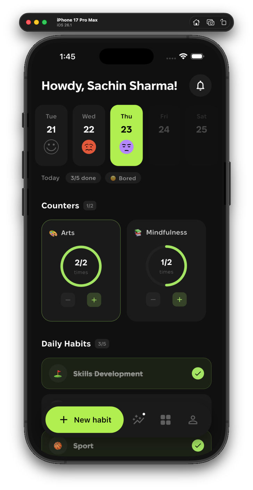
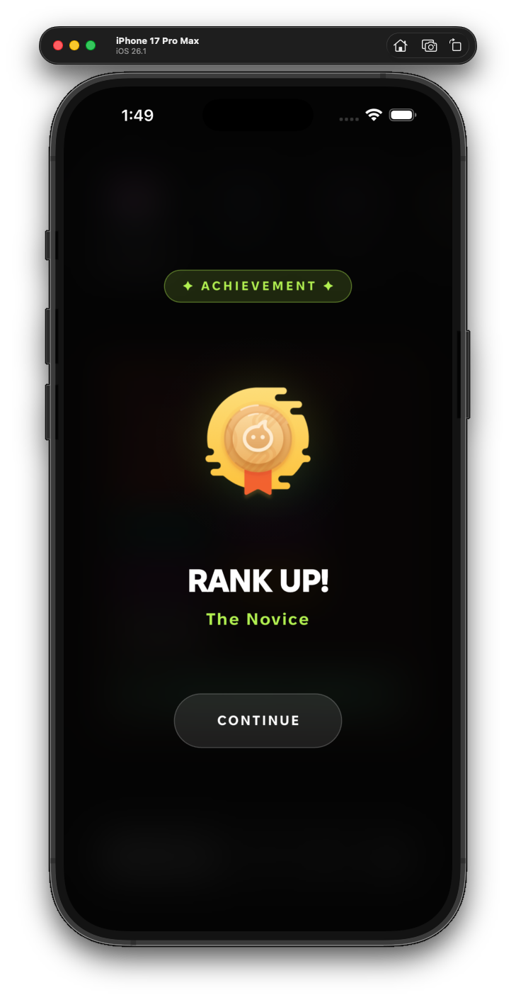
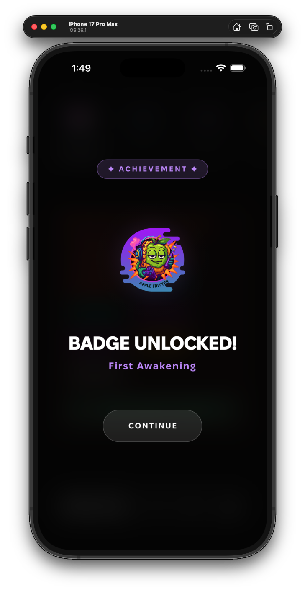
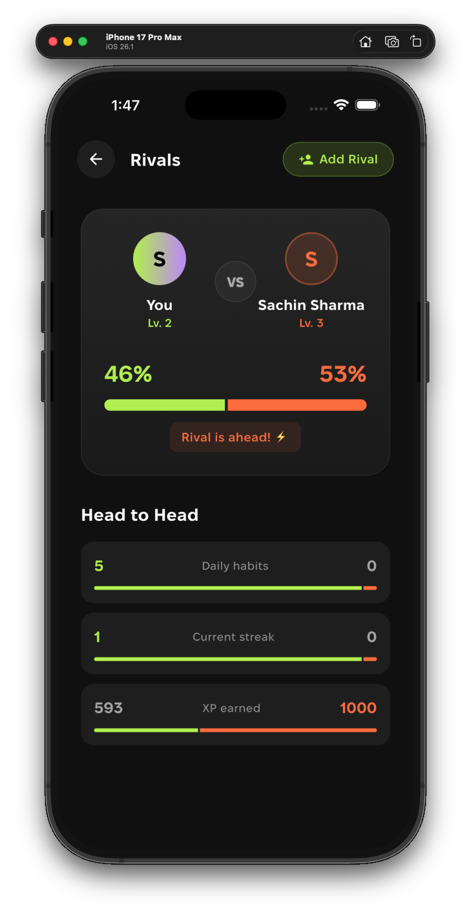
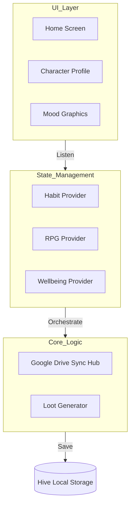
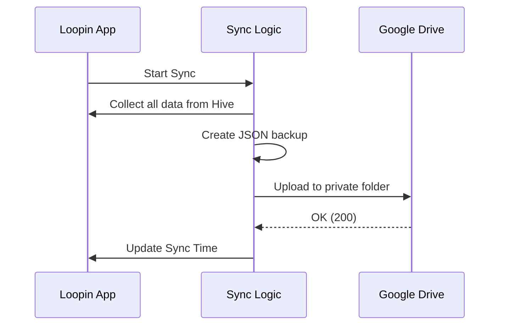

# Loopin: A Personal Habit Tracker with Data Privacy

  
   
  <b>A habit tracker built with Flutter that focuses on privacy and gamification.</b>

  
  
  

---

## 📌 Project Overview

Most habit trackers store user data on their own servers, which can be a privacy risk. **Loopin** solves this by using a "Zero-Server" approach. Your data stays on your phone and syncs only to your personal Google Drive. To make tracking more interesting, I added an RPG system where completing habits earned you XP and rewards.

[**Download Release APK**](https://github.com/maisachinsharmahu/Loopin-Showcase/releases/tag/v1.0.0) | [**Jump to Architecture**](#-deep-dive-loopin-system-architecture)

---

## 🛠 Features

### 1. The Centralized Hub
I designed a custom horizontal calendar where "Today" is always in the center. This makes it very easy to stay focused on today's tasks while scrolling through past performance.

  
  

### 2. RPG Progression System
Every time you complete a habit, you get XP, level up, and get "Loot Drops." I built an event queue so that if multiple rewards happen at once, they show up one by one smoothly.

  
  
  

### 3. Data Insights
The app calculates streaks and completion rates. I used Hive because it's a NoSQL database that is much faster than SQL, allowing the stats to update instantly as you scroll.

  
  
  

### 4. Achievements and Journey
I added a badge system and an achievement log to track your long-term progress.

  
  

### 5. Rivals and Social Sharing
You can see how you compare to "Rivals" and share your wins. Even with social features, the data remains private and encrypted.

  
  

---

## 🏗 Engineering Architecture

The app follows a **Reactive MVVM** pattern. It separates the UI from the logic using the **Provider** package.

### High-Level Design

---

## 🔬 Technical Case Studies (Problems I Solved)

### 1. Centering the Timeline
Standard lists in Flutter don't stay centered on a specific item. I had to write custom math for the `ScrollController` so that the app calculates exactly where "Today" should be based on the screen width.
`Offset = (Index * Width) + Padding - (Screen / 2) + (Card / 2)`

### 2. Google Drive Sync and Data Safety
Syncing can fail if the internet is slow. To prevent data corruption, I built a "Write-Ahead" sync logic. It packages everything into a JSON file and only updates the sync status after the Google Drive API confirms the file was safely saved.

### 3. iOS File Recognition
iOS does not know what a `.loopin` file is. I fixed this by registering a custom **UTI (Uniform Type Identifier)** in the `Info.plist`. Now the iOS Files app treats Loopin backups as proper documents.

---

## 🛠 Deep-Dive: System Design

### 1. RPG Event Queue
If you finish a habit and also unlock an achievement, the app might try to show two popups at once. I solved this by creating a **List-based Queue**. Every reward is "pushed" into the queue and "popped" one after another.

### 2. Database Schema
I split the data into multiple specialized **Hive Boxes** to keep lookups fast.
- `habit_box`: Core habit data.
- `checkin_box`: Completion history.
- `rpg_profile_box`: Level and XP.

### 3. Cloud Sync Flow

### 4. Custom Drawing (Canvas)
Instead of using images for the mood faces, I drew them using code (`CustomPainter`). This makes the app smaller in size and allows the faces to change colors dynamically based on the background.

### 5. Security
I used OAuth 2.0 to access Google Drive. The app only asks for the `drive.appdata` scope, which means it can only access its own folder and cannot see your other files on Google Drive.

---

## 🛤 Future Roadmap
- [x] Local Storage and Sync.
- [x] RPG mechanics and XP system.
- [ ] On-device AI for habit analysis.
- [ ] P2P challenges and more social features.

--- 
*Note: This repository is a technical showcase for my portfolio. The source code is proprietary.*
