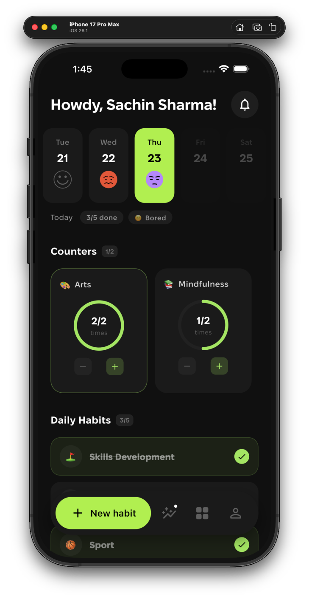
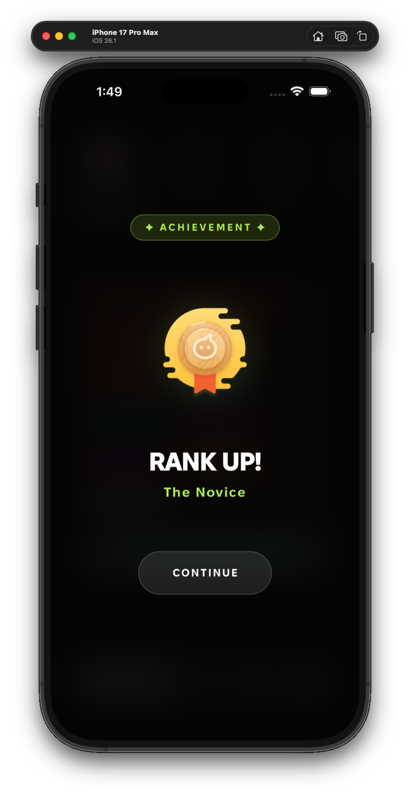
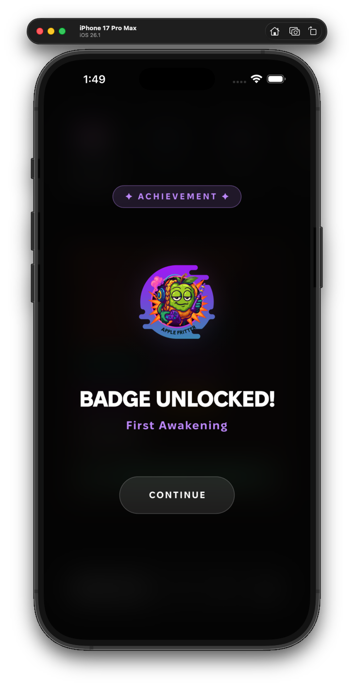
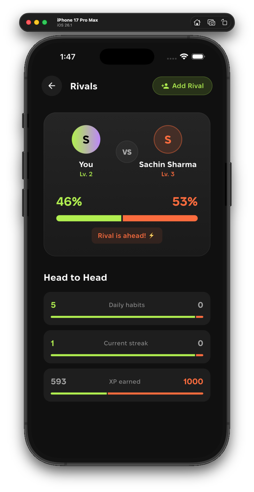

# Loopin — A Habit Tracker That Actually Keeps You Coming Back

  

Most habit trackers die the same way. You download it, feel motivated for
four or five days, then one streak breaks and the whole thing feels
pointless, so you delete the app. I've done this with at least six different
habit apps myself before I built Loopin.

The other problem is quieter but bigger. Every habit app I tried wanted to
store what habits I'm tracking, how many times I've failed, my sleep
schedule, my water intake, basically my whole daily life, on their server.
That's a lot of personal data to hand over just to remind yourself to drink
water, right?

So Loopin does two things differently.

**First, nothing leaves your phone unless you want it to.** Everything is
stored locally. If you turn on backup, it goes straight to your own personal
Google Drive folder, not to some company's database. Nobody but you can see
your habits, not even me.

**Second, it doesn't feel like homework.** Instead of a plain checklist,
completing a habit gives you XP, levels you up, and drops rewards, like a
small RPG quietly running in the background of your daily routine. Turns out
people stick to things longer when there's a small reward loop attached to
it, so that's exactly what this is built around.

[Download the APK from Releases](https://github.com/maisachinsharmahu/Loopin-Showcase/releases/tag/v1.0.0)

---

## What's actually in the app

**A calendar that keeps today in the center.** Most habit apps make you
scroll around to find today. Loopin's timeline always keeps today's card
centered, so you never lose your place, whether you're checking off today's
habits or scrolling back to see how last week went.

  
  

**The RPG layer.** Complete a habit, get XP. Level up, get a loot drop.
Finish three habits back to back and all three rewards queue up and play out
one after another instead of dumping on top of each other, small detail, but
it's the kind of thing that makes an app feel finished instead of thrown
together.

  
  
  

**Stats that update as you scroll.** Streaks, completion rates, all worked
out on your device itself, so there's no loading spinner every time you open
the stats tab.

  
  
  

**Achievements and a proper journey log**, so your long-term progress
actually shows up somewhere, not just today's checklist.

  
  

**Rivals, without giving up privacy.** You can compare progress with friends
and share your wins, but your actual habit data stays private and encrypted
even with the social features turned on.

  
  

---

## How it's built, the short version

Built in Flutter, so it feels native on both iOS and Android from one
codebase. Everything lives in a fast local database on your device itself,
that's what lets stats and streaks update instantly with no loading time at
all.

A couple of things took a lot more effort than they let on. The centered
timeline was one, normal scroll behaviour in Flutter doesn't keep a moving
list locked on one item, so that had to be built from scratch. The backup to
Drive was another, a habit tracker losing your data mid-sync is worse than
not having sync at all, so it's built to never leave things half-saved, even
if your internet drops in the middle of an upload.

I'm not going deeper into the exact architecture here since this repo is a
showcase and the source stays closed, but if you're genuinely curious how
some part of it works, just ask me directly. I like talking about this stuff.

---

## What's next

- [x] Local-first storage and Drive backup
- [x] RPG mechanics and XP system
- [ ] On-device suggestions based on your own habit patterns
- [ ] Challenges between friends

---

This is a portfolio showcase repo, the source code is closed. Want to see it
running properly, download the APK above, or just message me and I'll walk
you through it myself.

**[sachinsharma.dev](https://sachinsharma.dev)**
